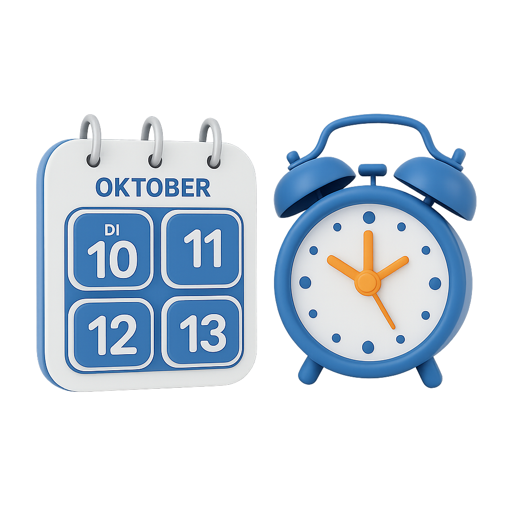
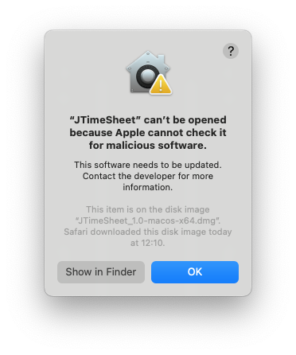
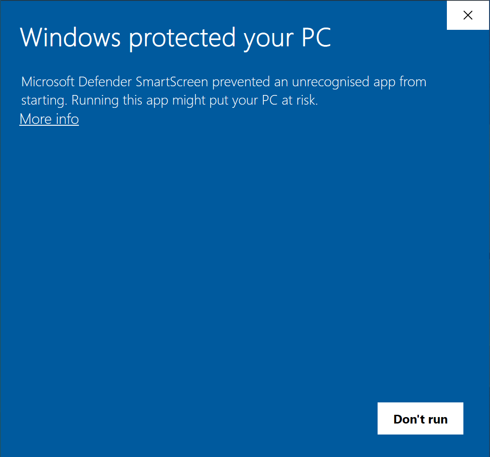
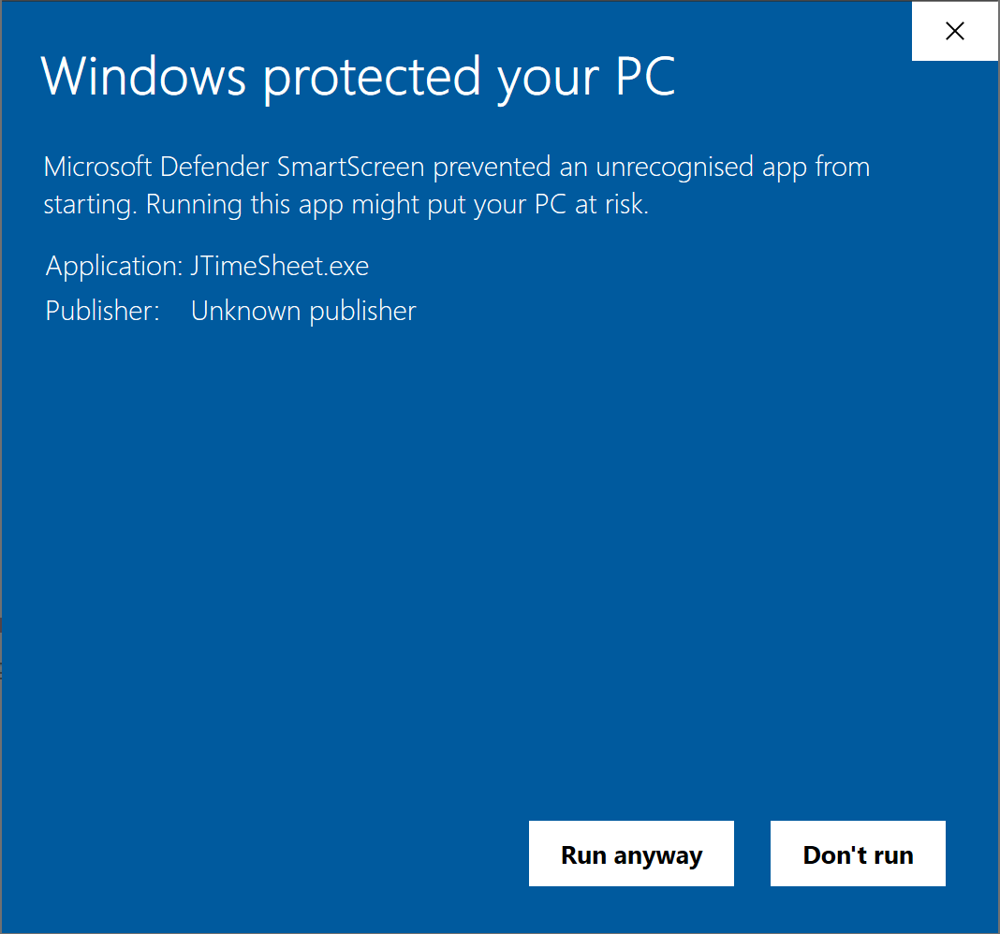

# JTimeSheet



JTimeSheet is a program for recording working hours and writing timesheets.

# Releases

[](https://github.com/treimers/JTimeSheet/releases/latest)

Downloads: **[Latest release](https://github.com/treimers/JTimeSheet/releases/latest)**

## Security Warnings on Startup (Windows / macOS)

After downloading from GitHub, Windows or macOS may block execution because the application is not signed. Here's how you can still start JTimeSheet:

### macOS

On macOS you may see.



- **Right-click** on the app → select **"Open"** → confirm **"Open"** again in the dialog.
- Or in Terminal (adjust path):
  ```bash
  xattr -cr /path/to/JTimeSheet.app
  ```

### Windows

Under Windows you might get.



- For the SmartScreen warning, click **"More info"**.
- Then select **"Run anyway"**.

